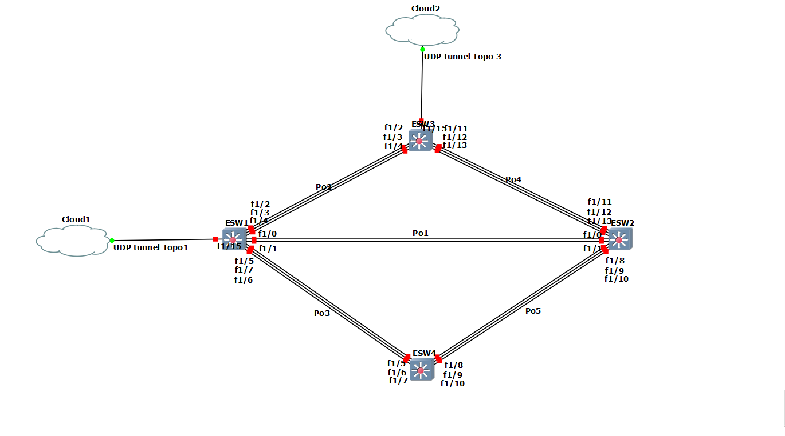
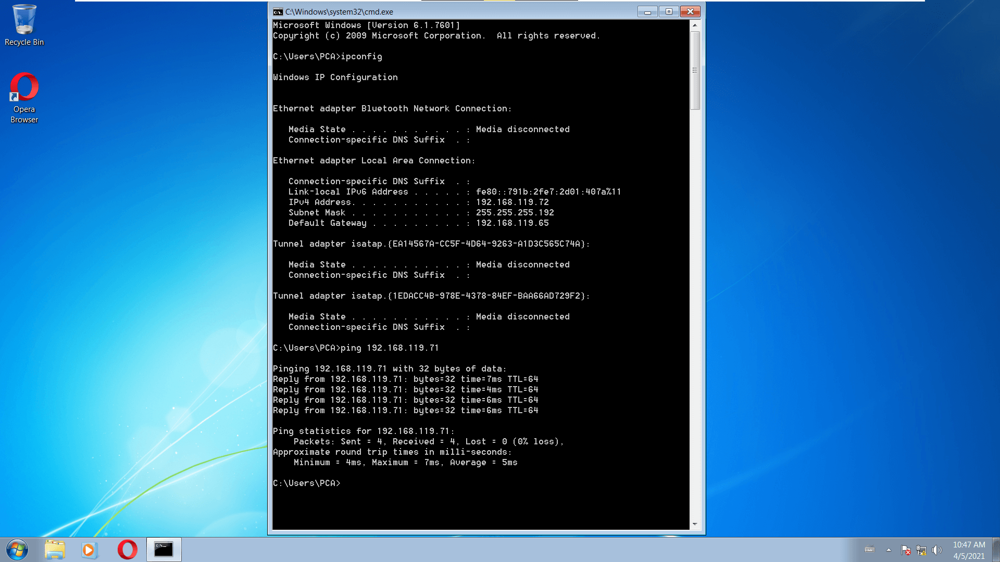
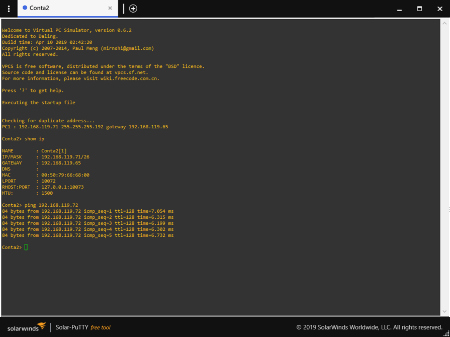
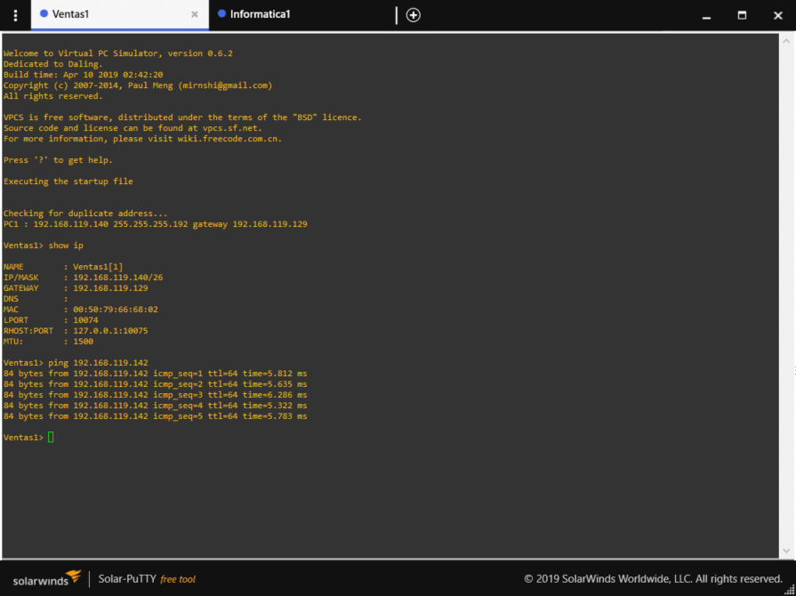
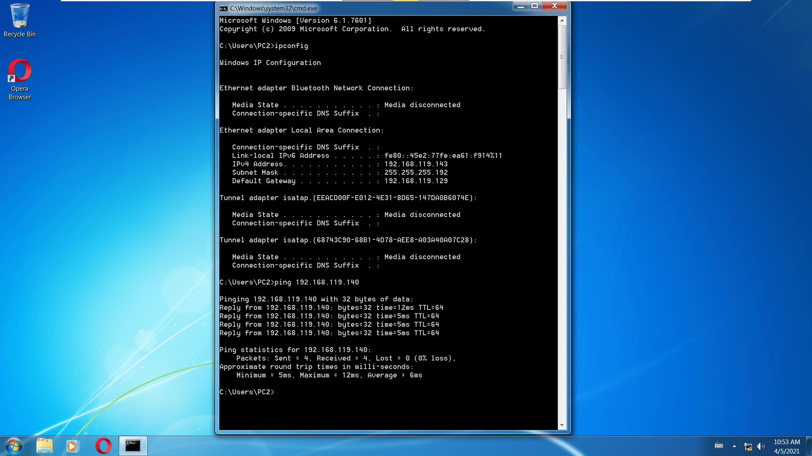
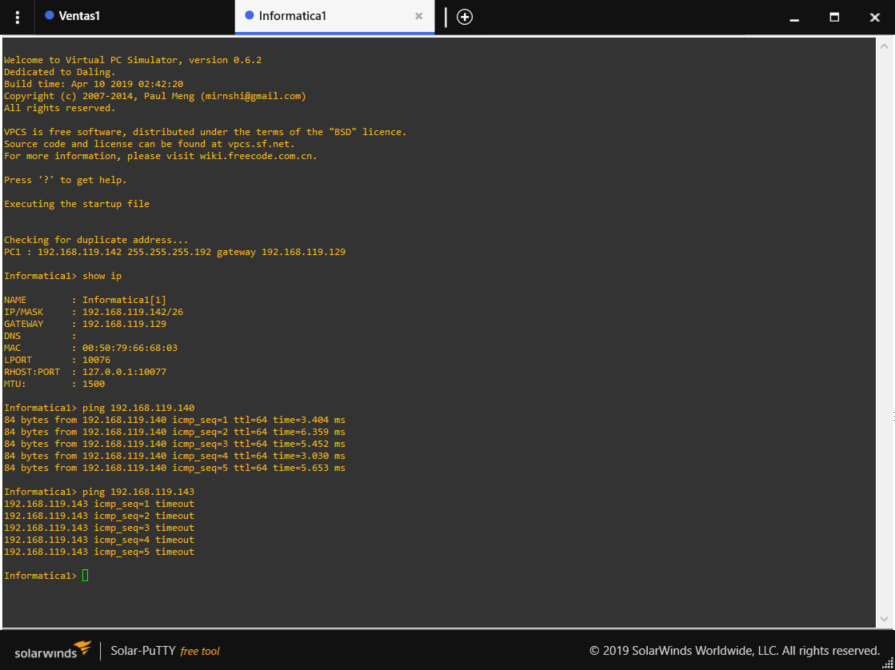

# Redes1-Practica2_G19

- [Redes1-Practica2_G19](#redes1-practica2_g19)
  - [INTEGRANTES](#integrantes)
  - [Configuración de red multipunto](#configuración-de-red-multipunto)
    - [Conexión topología 1](#conexión-topología-1)
    - [Conexión topología 2](#conexión-topología-2)
    - [Conexión topología 3](#conexión-topología-3)
  - [Configuración de la topología de red en GNS3](#configuración-de-la-topología-de-red-en-gns3)
    - [Red topología 1](#red-topología-1)
    - [Red topología 2](#red-topología-2)
    - [Red topología 3](#red-topología-3)
  - [Configuración por dispositivo](#configuración-por-dispositivo)
    - [Configuración topología 1](#configuración-topología-1)
    - [Configuración topología 2](#configuración-topología-2)
    - [Configuración topología 3](#configuración-topología-3)
  - [Comandos utilizados](#comandos-utilizados)
    - [Archivos de configuración](#archivos-de-configuración)

## INTEGRANTES

|  CARNET   | NOMBRE                        |
| :-------: | ----------------------------- |
| 201020831 | Marco Antonio Chavez Fuentes  |
| 201612331 | Jose Orlando Wannan Escobar   |
| 201602421 | Diego Alejandro Vasquez       |
| 201712350 | Helmut Efrain Najarro Alvarez |

## Configuración de red multipunto

### Conexión topología 1

>Infomatica a Ventas

>Ventas a Informatica

### Conexión topología 2

### Conexión topología 3

>Cliente contabilidad 1

>Cliente contabilidad 2

>Cliente ventas 1

>Cliente ventas 2

>Cliente informatica 1

## Configuración de la topología de red en GNS3

### Red topología 1

### Red topología 2

### Red topología 3

> Topología 3

## Configuración por dispositivo

### Configuración topología 1

### Configuración topología 2

### Configuración topología 3

- UDP Tunnel:
  - Remote host: 10.8.0.3
  - Local port: 20000
  - Remote port: 30000
- Switch capa 3 1:
  - Port Channel 1 (f1/0-1): Modo troncal
  - Port Channel 3 (f1/4-5): Modo troncal
  - f1/10: Modo troncal
  - VTP modo cliente
  - VLAN: 10, 20 y 30
- Switch capa 3 2:
  - Port Channel 1 (f1/0-1): Modo troncal
  - Port Channel 2 (f1/2-3): Modo troncal
  - f1/10: Modo troncal
  - VTP modo cliente
  - VLAN: 10, 20 y 30
- Switch capa 3 3:
  - Port Channel 2 (f1/2-3): Modo troncal
  - Port Channel 3 (f1/4-5): Modo troncal
  - f1/15: Modo troncal
  - VTP modo cliente
  - VLAN: 10, 20 y 30
- Switch capa 3 4:
  - Port Channel 4 (f1/4-5): Modo troncal
  - f1/10: Modo acceso a la vlan 20
  - VTP modo cliente
  - VLAN: 10, 20 y 30
- Switch capa 2 1:
  - e0: modo troncal
  - e2: modo acceso a la vlan 30
  - e3: modo acceso a la vlan 20
- Switch capa 2 2:
  - e0: modo troncal
  - e2: modo acceso a la vlan 30
  - e3: modo acceso a la vlan 30
- Contabilidad 1:
  - IP: 192.168.119.72/26
  - Gateway: 192.168.119.65
  - VLAN: 20
- Contabilidad 2:
  - IP: 192.168.119.72/26
  - Gateway: 192.168.119.65
  - VLAN: 20
- Ventas 1:
  - IP: 192.168.119.140/26
  - Gateway: 192.168.119.129
  - VLAN: 30
- Ventas 2:
  - IP: 192.168.119.143/26
  - Gateway: 192.168.119.129
  - VLAN: 30
- Informatica 1:
  - IP: 192.168.119.142/26
  - Gateway: 192.168.119.129
  - VLAN: 30

## Comandos utilizados

Para configurar los switches de capa 3, se siguieron los siguientes pasos:

- Crear Port Channels a cada switch de las 3 topologías
- Crear vtp de tipo cliente a cada switch de las 3 topologías, excepto al 1er switch de la topología 2 que debía ser tipo servidor
- En el switch servidor de la topología 3, se crearon las 3 vlans
- En cada switch se configuraron los enlaces troncales y de acceso según el puerto lo requiera.

### Archivos de configuración

[Configuración topología 1](Topo1_conf.md)

[Configuración topología 2](Topo2_conf.md)

[Configuración topología 3](Topo3_conf.md)
